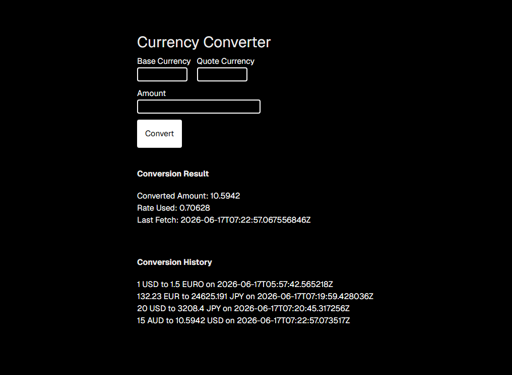

# currency-converter
Basic currency conversion app utilizing the Frankfurter API

### UI Start-Up
```shell
# From root dir
cd currency-converter-ui
npm install
npm run dev
```

### DB & Backend Start-Up
`docker compose up -d`

DB Can be viewed at http://localhost:8090  
**Email:** test@user.com  
**Password:** password

#### DB Server Details:  
**hostname:** db  
**port:** 5432  
**user:** postgres  
**password:** password  

